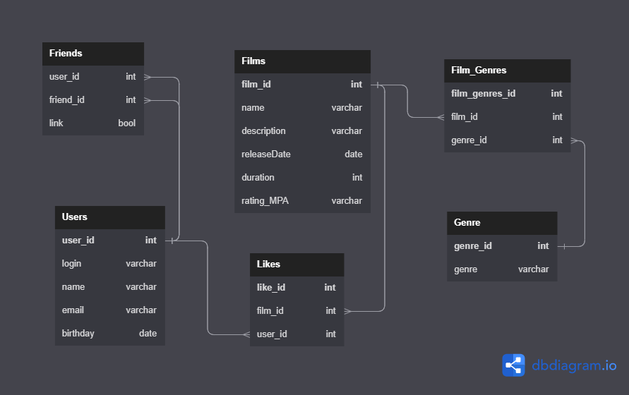

<h1 style="text-align: center; color: purple">java-filmorate</h1>

This project implements the functionality of adding, deleting, updating movies (with ratings and genres), 
users, likes, searching for the best movies based on user likes.  

Data storage can be configured in memory or in the H2 database. The project uses custom validators for movies and users.   
The database schema is shown below:

